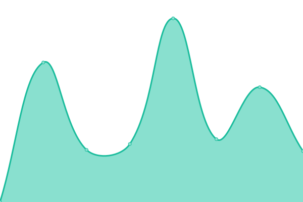
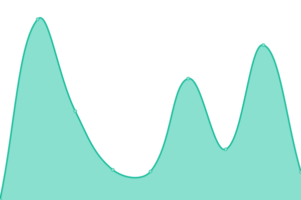

# [📈 Live Status](https://status.exputra.com): <!--live status--> **🟧 Partial outage**

This repository contains the open-source uptime monitor and status page for [Arif Saputra](https://status.exputra.com), powered by [Upptime](https://github.com/upptime/upptime).

With [Upptime](https://upptime.js.org), you can get your own unlimited and free uptime monitor and status page, powered entirely by a GitHub repository. We use [Issues](https://github.com/mrays/status.exputra.com/issues) as incident reports, [Actions](https://github.com/mrays/status.exputra.com/actions) as uptime monitors, and [Pages](https://status.exputra.com) for the status page.

<!--start: status pages-->
<!-- This summary is generated by Upptime (https://github.com/upptime/upptime) -->
<!-- Do not edit this manually, your changes will be overwritten -->
<!-- prettier-ignore -->
| URL | Status | History | Response Time | Uptime |
| --- | ------ | ------- | ------------- | ------ |
|  [Indonesia Coconuts (24 Juni 2024)](https://indonesiacoconuts.com) | 🟩 Up | [indonesia-coconuts-24-juni-2024.yml](https://github.com/mrays/status.exputra.com/commits/HEAD/history/indonesia-coconuts-24-juni-2024.yml) | 

 1210ms
     
 | 

<a href="https://status.exputra.com/history/indonesia-coconuts-24-juni-2024">99.93%</a>
    

|  [Binuang Sakti (05 Agustus 2024)](https://binuangsaktiperkasa.com/) | 🟩 Up | [binuang-sakti-05-agustus-2024.yml](https://github.com/mrays/status.exputra.com/commits/HEAD/history/binuang-sakti-05-agustus-2024.yml) | 

 914ms
     
 | 

<a href="https://status.exputra.com/history/binuang-sakti-05-agustus-2024">99.95%</a>
    

|  [Global Intl Logistics (14 Juli 2024)](https://globalintllogistics.com) | 🟩 Up | [global-intl-logistics-14-juli-2024.yml](https://github.com/mrays/status.exputra.com/commits/HEAD/history/global-intl-logistics-14-juli-2024.yml) | 

 5696ms
     
 | 

<a href="https://status.exputra.com/history/global-intl-logistics-14-juli-2024">99.46%</a>
    

|  [Hinggil Spices (09 Oktober 2024)](https://hinggil-spices.com) | 🟩 Up | [hinggil-spices-09-oktober-2024.yml](https://github.com/mrays/status.exputra.com/commits/HEAD/history/hinggil-spices-09-oktober-2024.yml) | 

 4060ms
     
 | 

<a href="https://status.exputra.com/history/hinggil-spices-09-oktober-2024">99.61%</a>
    

|  [Sahabat Tukang (12 Mei 2024)](https://sahabattukang.id) | 🟩 Up | [sahabat-tukang-12-mei-2024.yml](https://github.com/mrays/status.exputra.com/commits/HEAD/history/sahabat-tukang-12-mei-2024.yml) | 

 2381ms
     
 | 

<a href="https://status.exputra.com/history/sahabat-tukang-12-mei-2024">99.62%</a>
    

|  [Siputra Digital (24 Juni 2024)](https://siputra.digital/) | 🟩 Up | [siputra-digital-24-juni-2024.yml](https://github.com/mrays/status.exputra.com/commits/HEAD/history/siputra-digital-24-juni-2024.yml) | 

 3875ms
     
 | 

<a href="https://status.exputra.com/history/siputra-digital-24-juni-2024">28.07%</a>
    

|  [Jasa WC Terdekat (05 Juni 2024)](https://jasasedotwcterdekat.id/) | 🟩 Up | [jasa-wc-terdekat-05-juni-2024.yml](https://github.com/mrays/status.exputra.com/commits/HEAD/history/jasa-wc-terdekat-05-juni-2024.yml) | 

 4173ms
     
 | 

<a href="https://status.exputra.com/history/jasa-wc-terdekat-05-juni-2024">98.31%</a>
    

|  [Sumur Bor (04 Juni 2024)](https://sumur-bor.com/) | 🟩 Up | [sumur-bor-04-juni-2024.yml](https://github.com/mrays/status.exputra.com/commits/HEAD/history/sumur-bor-04-juni-2024.yml) | 

 3682ms
     
 | 

<a href="https://status.exputra.com/history/sumur-bor-04-juni-2024">91.49%</a>
    

|  [Kamba Jaya Industri (17 November 2024)](https://kambajayaindustri.com/) | 🟩 Up | [kamba-jaya-industri-17-november-2024.yml](https://github.com/mrays/status.exputra.com/commits/HEAD/history/kamba-jaya-industri-17-november-2024.yml) | 

 1144ms
     
 | 

<a href="https://status.exputra.com/history/kamba-jaya-industri-17-november-2024">99.03%</a>
    

|  [Fajarindo Buana Ekspress (12 Desember 2024)](https://pt.fajarindobuanaexpress.com/) | 🟩 Up | [fajarindo-buana-ekspress-12-desember-2024.yml](https://github.com/mrays/status.exputra.com/commits/HEAD/history/fajarindo-buana-ekspress-12-desember-2024.yml) | 

 3362ms
     
 | 

<a href="https://status.exputra.com/history/fajarindo-buana-ekspress-12-desember-2024">97.92%</a>
    

|  [Aksa Jasa Global (06 Desember 2024)](https://aksajasaglobal.com/) | 🟩 Up | [aksa-jasa-global-06-desember-2024.yml](https://github.com/mrays/status.exputra.com/commits/HEAD/history/aksa-jasa-global-06-desember-2024.yml) | 

 3194ms
     
 | 

<a href="https://status.exputra.com/history/aksa-jasa-global-06-desember-2024">99.75%</a>
    

|  [Factory Bagan Citra Lestari (13 November 2024)](https://factorybagancitralestari.com) | 🟩 Up | [factory-bagan-citra-lestari-13-november-2024.yml](https://github.com/mrays/status.exputra.com/commits/HEAD/history/factory-bagan-citra-lestari-13-november-2024.yml) | 

 696ms
     
 | 

<a href="https://status.exputra.com/history/factory-bagan-citra-lestari-13-november-2024">99.13%</a>
    

|  [Jasa Pipa Mampet (22 Desember 2024)](https://jasapipamampetkediri.site/) | 🟩 Up | [jasa-pipa-mampet-22-desember-2024.yml](https://github.com/mrays/status.exputra.com/commits/HEAD/history/jasa-pipa-mampet-22-desember-2024.yml) | 

 1350ms
     
 | 

<a href="https://status.exputra.com/history/jasa-pipa-mampet-22-desember-2024">100.00%</a>
    

|  [Jasa Pipa Mampet 2 (22 Januari 2025)](https://jasapipamampettulungagung.my.id/) | 🟩 Up | [jasa-pipa-mampet-2-22-januari-2025.yml](https://github.com/mrays/status.exputra.com/commits/HEAD/history/jasa-pipa-mampet-2-22-januari-2025.yml) | 

 1247ms
     
 | 

<a href="https://status.exputra.com/history/jasa-pipa-mampet-2-22-januari-2025">100.00%</a>
    

|  [Herisa.id (22 Februari 2024)](https://herisa.id) | 🟥 Down | [herisa-id-22-februari-2024.yml](https://github.com/mrays/status.exputra.com/commits/HEAD/history/herisa-id-22-februari-2024.yml) | 

 0ms
     
 | 

<a href="https://status.exputra.com/history/herisa-id-22-februari-2024">0.00%</a>
    

|  [Muslimin Indonesia Tour (26 Januari 2026)](https://muslimindonesiatours.com) | 🟩 Up | [muslimin-indonesia-tour-26-januari-2026.yml](https://github.com/mrays/status.exputra.com/commits/HEAD/history/muslimin-indonesia-tour-26-januari-2026.yml) | 

 4907ms
     
 | 

<a href="https://status.exputra.com/history/muslimin-indonesia-tour-26-januari-2026">98.85%</a>
    

|  [Askatama (1 Januari 2025/1)](https://askatama.biz.id) | 🟩 Up | [askatama-1-januari-2025-1.yml](https://github.com/mrays/status.exputra.com/commits/HEAD/history/askatama-1-januari-2025-1.yml) | 

 4514ms
     
 | 

<a href="https://status.exputra.com/history/askatama-1-januari-2025-1">99.32%</a>
    

|  [Sunnahstori (03 Februari 2025)](https://sunnahstori.com) | 🟩 Up | [sunnahstori-03-februari-2025.yml](https://github.com/mrays/status.exputra.com/commits/HEAD/history/sunnahstori-03-februari-2025.yml) | 

 5793ms
     
 | 

<a href="https://status.exputra.com/history/sunnahstori-03-februari-2025">100.00%</a>
    

|  [Sedot WC Dua Putri (26 Desember 2025)](https://sedotwcduaputri.my.id) | 🟩 Up | [sedot-wc-dua-putri-26-desember-2025.yml](https://github.com/mrays/status.exputra.com/commits/HEAD/history/sedot-wc-dua-putri-26-desember-2025.yml) | 

 1271ms
     
 | 

<a href="https://status.exputra.com/history/sedot-wc-dua-putri-26-desember-2025">99.22%</a>
    

<!--end: status pages-->

[**Visit our status website →**](https://status.exputra.com)

## 📄 License

- Powered by: [Upptime](https://github.com/upptime/upptime)
- Code: [MIT](./LICENSE) © [Arif Saputra](https://status.exputra.com)
- Data in the `./history` directory: [Open Database License](https://opendatacommons.org/licenses/odbl/1-0/)
